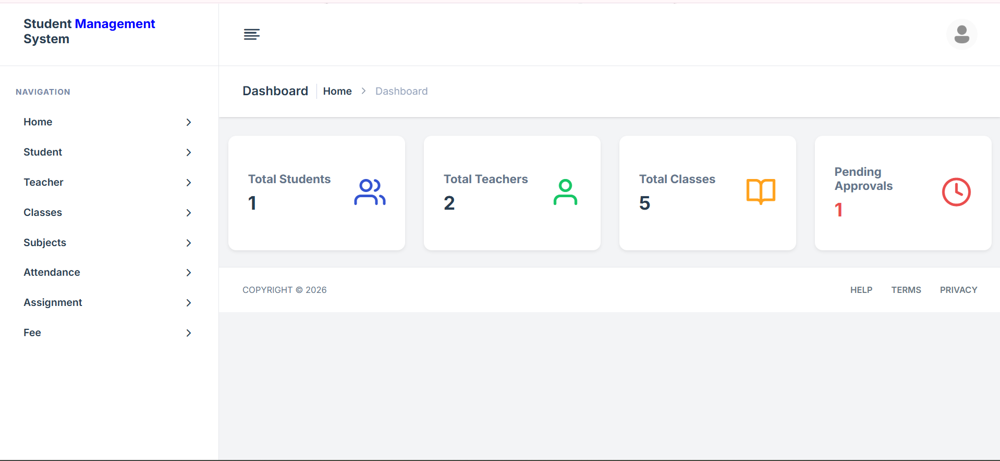
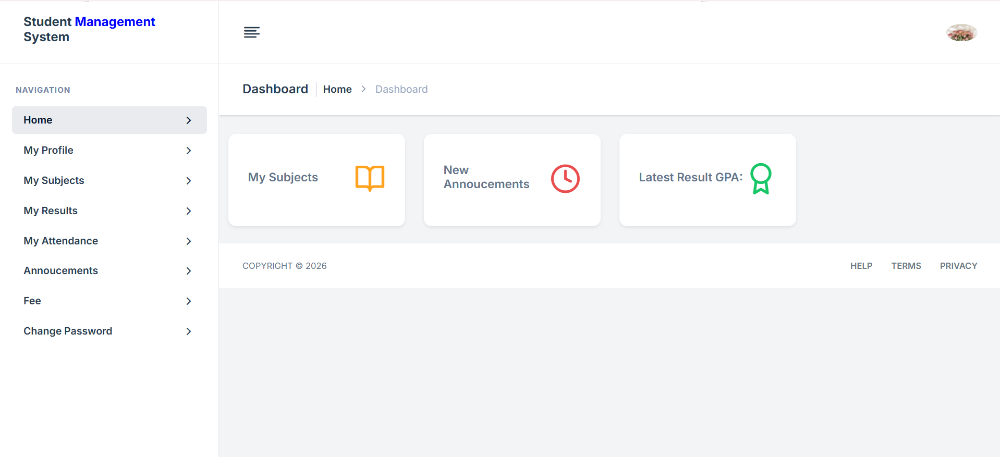
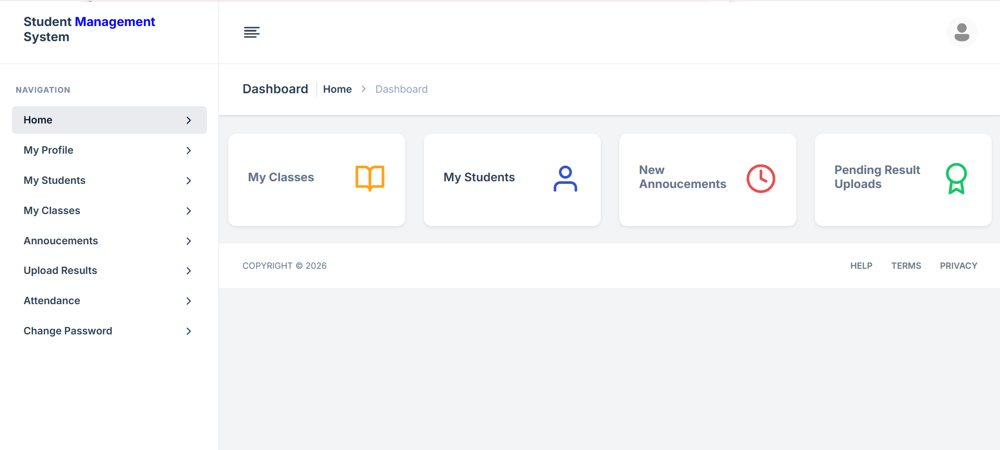

# Student Management System (SMS)

A web-based Student Management System with separate, secure portals for Administrators, Teachers, and Students — built to automate academic operations including attendance, results, fee tracking, and announcements.

## 📸 Screenshots
| Admin Dashboard | Student Portal | Teacher Portal |
|---|---|---|
|  |  |  |

## 🚀 Key Features

### 👑 Administrator Portal
- User registration, approval, and profile management
- Manage classes, sections, subjects, and teacher assignments
- Fee management: create types, issue dues, record payments
- Institution-wide announcements

### 👩‍🏫 Teacher Portal
- Daily attendance tracking for assigned classes
- Enter exam marks and submit student results
- Monitor class rosters and academic progress

### 🎓 Student Portal
- Visual performance dashboard with grades and percentages
- Detailed result breakdowns per subject
- Fee status and payment history
- Announcements feed

## 🛠 Tech Stack
- **Backend:** PHP
- **Database:** MySQL
- **Frontend:** HTML5, CSS3 (Bootstrap + custom stylesheets), JavaScript

## ⚙️ Installation

1. Install [Laragon](https://laragon.org/), XAMPP, or WAMP
2. Clone or place the `SMS` folder in your server root:
   - Laragon: `C:\laragon\www\SMS`
   - XAMPP: `C:\xampp\htdocs\SMS`
3. Open phpMyAdmin → create a database named `student_management_system` → import the `database/student_management_system.sql`
4. Update credentials in `includes/conn.php` if needed
5. Visit `http://localhost/SMS`

## 🔒 Security
Role-based authentication
Session-based access control
Protected dashboards per role
Restricted route access

##     Default Login

Admin:
Email: Admin@gmail.com
Password: admin123

*To access Student Dashboard and Teacher Dashboard, you can create account!*

## Credits
Dashboard UI adapted from [Duralux – PHP Admin & Dashboard Template](https://themeforest.net/item/duralux-php-admin-dashboard-template/55822753) by maryinparis.

## 🚧 Future Improvements

This project is actively being developed. New features and improvements will be added in future updates, including performance enhancements, UI improvements, and additional academic management modules.